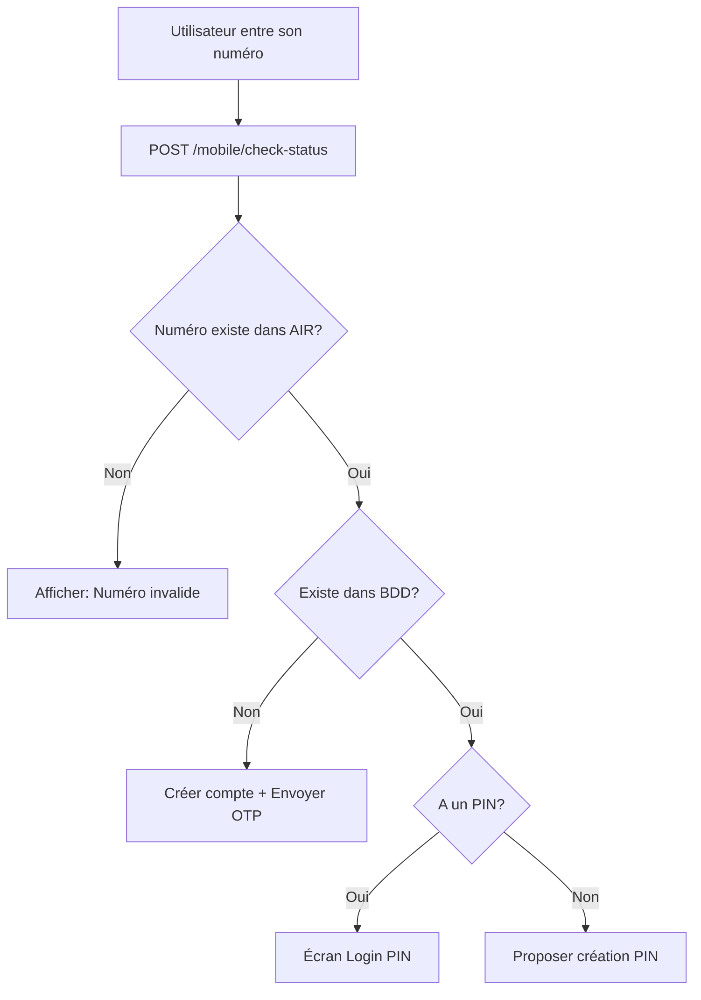

# Mobile Status Check API

Documentation pour l'endpoint de vérification du statut d'un numéro mobile.

## Endpoint

```
POST /api/mobile/check-status
```

**Note**: Cet endpoint ne nécessite **aucun middleware d'authentification**.

## Description

Cet endpoint permet de vérifier le statut complet d'un numéro mobile en deux étapes :

1. **Vérification dans le système AIR** : Vérifie si le numéro existe dans le système de télécommunication
2. **Vérification dans la base de données locale** : Si le numéro existe dans AIR, vérifie s'il est enregistré dans notre BDD et retourne les informations associées

## Paramètres de requête

### Body (JSON)

| Paramètre | Type | Requis | Description |
|-----------|------|--------|-------------|
| `msisdn` | string | Oui | Numéro mobile (8 chiffres commençant par 77, ou 11 chiffres avec le code pays 253) |

### Exemples de formats acceptés
- `77123456` (format local 8 chiffres)
- `25377123456` (format international)

## Réponses

### Cas 1 : Numéro non trouvé dans AIR

**Status Code**: `404 Not Found`

```json
{ 
    "success": false,
    "message": "Numéro non trouvé dans le système",
    "data": {
        "exists_in_air": false,
        "msisdn": "77123456",
        "code_reponse": 102,
        "message_air": "Abonné non trouvé"
    }
}
```

### Cas 2 : Numéro trouvé dans AIR mais pas dans la BDD locale

**Status Code**: `200 OK`

```json
{
    "success": true,
    "message": "Numéro trouvé",
    "data": {
        "exists_in_air": true,
        "exists_in_database": false,
        "msisdn": "77123456",
        "has_pin": false,
        "account_type": "prepaid"
    }
}
```

### Cas 3 : Numéro trouvé dans AIR et dans la BDD locale (sans PIN)

**Status Code**: `200 OK`

```json
{
    "success": true,
    "message": "Numéro trouvé",
    "data": {
        "exists_in_air": true,
        "exists_in_database": true,
        "msisdn": "77123456",
        "has_pin": false,
        "account_type": "prepaid",
        "user_info": {
            "is_active": true,
            "has_fcm_token": false,
            "last_login_at": null,
            "pin_set_at": null
        }
    }
}
```

### Cas 4 : Numéro trouvé dans AIR et dans la BDD locale (avec PIN)

**Status Code**: `200 OK`

```json
{
    "success": true,
    "message": "Numéro trouvé",
    "data": {
        "exists_in_air": true,
        "exists_in_database": true,
        "msisdn": "77654321",
        "has_pin": true,
        "account_type": "prepaid",
        "user_info": {
            "is_active": true,
            "has_fcm_token": true,
            "last_login_at": "2025-12-20 15:30:00",
            "pin_set_at": "2025-12-15 10:00:00"
        }
    }
}
```

### Cas 5 : Numéro postpayé

**Status Code**: `200 OK`

```json
{
    "success": true,
    "message": "Numéro trouvé",
    "data": {
        "exists_in_air": true,
        "exists_in_database": false,
        "msisdn": "77987654",
        "has_pin": false,
        "account_type": "postpaid"
    }
}
```

## Champs de la réponse

### Champs principaux

| Champ | Type | Description |
|-------|------|-------------|
| `success` | boolean | Indique si la requête a réussi |
| `message` | string | Message descriptif du résultat |
| `data` | object | Objet contenant les données du statut |

### Champs dans `data`

| Champ | Type | Présence | Description |
|-------|------|----------|-------------|
| `exists_in_air` | boolean | Toujours | Indique si le numéro existe dans le système AIR |
| `exists_in_database` | boolean | Si `exists_in_air: true` | Indique si le numéro est enregistré dans notre BDD |
| `msisdn` | string | Toujours | Numéro mobile normalisé (format 8 chiffres) |
| `has_pin` | boolean | Si `exists_in_air: true` | Indique si l'utilisateur a configuré un PIN |
| `account_type` | string | Si `exists_in_air: true` | Type de compte: `"prepaid"` ou `"postpaid"` |
| `user_info` | object | Si `exists_in_database: true` | Informations supplémentaires sur l'utilisateur |
| `code_reponse` | integer | Si `exists_in_air: false` | Code de réponse du système AIR |
| `message_air` | string | Si `exists_in_air: false` | Message d'erreur du système AIR |

### Champs dans `user_info` (si présent)

| Champ | Type | Description |
|-------|------|-------------|
| `is_active` | boolean | Indique si le compte utilisateur est actif |
| `has_fcm_token` | boolean | Indique si l'utilisateur a un token FCM pour les notifications |
| `last_login_at` | string\|null | Date et heure de la dernière connexion (format: Y-m-d H:i:s) |
| `pin_set_at` | string\|null | Date et heure de configuration du PIN (format: Y-m-d H:i:s) |

## Détermination du type de compte

Le système détermine automatiquement le type de compte en utilisant le champ **`serviceClassCurrent`** retourné par l'API AIR :

### Logique de détection

```php
serviceClassCurrent >= 500 → Prepayé (Prépayé)
serviceClassCurrent < 500  → Postpayé (Postpayé)
```

### Prepaid (Prépayé) - `serviceClassCurrent >= 500`
- Service Class : 500, 501, 502, 600, etc.
- Système de recharge par carte/voucher
- Supervision du compte avec dates d'expiration
- Type le plus courant pour les particuliers
- Exemple : Abonnements Raxas, Liberty

### Postpaid (Postpayé) - `serviceClassCurrent < 500`
- Service Class : 100, 200, 300, 400, etc.
- Facturation mensuelle
- Pas de date de supervision
- Généralement pour les entreprises et contrats
- Exemple : Forfaits entreprise, lignes corporatives

## Exemples de requêtes

### cURL

```bash
# Vérifier un numéro existant
curl -X POST http://localhost:8000/api/mobile/check-status \
  -H "Content-Type: application/json" \
  -H "Accept: application/json" \
  -d '{
    "msisdn": "77123456"
  }'

# Vérifier un numéro inexistant
curl -X POST http://localhost:8000/api/mobile/check-status \
  -H "Content-Type: application/json" \
  -H "Accept: application/json" \
  -d '{
    "msisdn": "77999999"
  }'
```

### JavaScript (Fetch)

```javascript
// Vérifier le statut d'un numéro
async function checkMobileStatus(msisdn) {
  try {
    const response = await fetch('http://localhost:8000/api/mobile/check-status', {
      method: 'POST',
      headers: {
        'Content-Type': 'application/json',
        'Accept': 'application/json'
      },
      body: JSON.stringify({ msisdn })
    });

    const data = await response.json();

    if (data.success) {
      console.log('Numéro trouvé:', data.data);

      if (data.data.exists_in_database) {
        if (data.data.has_pin) {
          console.log('Utilisateur a un PIN - Rediriger vers login PIN');
        } else {
          console.log('Utilisateur sans PIN - Proposer de créer un PIN');
        }
      } else {
        console.log('Nouveau numéro - Inscription nécessaire');
      }
    } else {
      console.log('Numéro non trouvé:', data.message);
    }

    return data;
  } catch (error) {
    console.error('Erreur:', error);
  }
}

// Utilisation
checkMobileStatus('77123456');
```

### PHP (Laravel HTTP Client)

```php
use Illuminate\Support\Facades\Http;

$response = Http::post('http://localhost:8000/api/mobile/check-status', [
    'msisdn' => '77123456'
]);

$data = $response->json();

if ($data['success']) {
    $hasPin = $data['data']['has_pin'];
    $accountType = $data['data']['account_type'];

    if ($hasPin) {
        // Rediriger vers login avec PIN
    } else {
        // Proposer de créer un PIN
    }
}
```

## Cas d'utilisation

### 1. Flux d'inscription/connexion mobile



### 2. Vérification avant inscription

Avant de créer un nouveau compte, vérifier que :
- Le numéro existe dans le système AIR
- Le numéro n'est pas déjà enregistré
- Le type de compte (prepaid/postpaid)

### 3. Support client

Permettre au support de vérifier rapidement :
- Si un numéro existe dans le système
- Si le client a configuré un PIN
- La date de dernière connexion
- Le statut d'activité du compte

## Codes d'erreur

| Code HTTP | Code AIR | Signification |
|-----------|----------|---------------|
| 404 | 102 | Abonné non trouvé dans le système AIR |
| 200 | 0 | Succès - Abonné trouvé |
| 422 | - | Erreur de validation (format MSISDN invalide) |

## Erreurs de validation

### Format MSISDN invalide

**Status Code**: `422 Unprocessable Entity`

La validation accepte uniquement les formats suivants :
- **Format local** : 8 chiffres commençant par `77` (ex: `77123456`)
- **Format international** : 11 chiffres commençant par `25377` (ex: `25377123456`)

**Exemples d'erreurs** :

```json
// Numéro trop court (7 chiffres)
{
    "message": "validation.regex",
    "errors": {
        "msisdn": ["validation.regex"]
    }
}

// Numéro ne commence pas par 77
{
    "message": "validation.regex",
    "errors": {
        "msisdn": ["validation.regex"]
    }
}

// Format international incorrect (253 sans 77)
{
    "message": "validation.regex",
    "errors": {
        "msisdn": ["validation.regex"]
    }
}
```

**Formats invalides** :
- ❌ `1234567` (7 chiffres - trop court)
- ❌ `12345678` (ne commence pas par 77)
- ❌ `253123456` (code pays sans 77)
- ❌ `7712345` (7 chiffres - incomplet)
- ❌ `771234567` (9 chiffres - trop long)

**Formats valides** :
- ✅ `77123456` (8 chiffres local)
- ✅ `77166677` (8 chiffres local)
- ✅ `25377123456` (11 chiffres international)
- ✅ `25377166677` (11 chiffres international)

## Sécurité

### Protection des données sensibles
- Le PIN n'est **jamais** retourné dans la réponse (seulement `has_pin: true/false`)
- Les informations sensibles du device (`device_info`) ne sont pas exposées
- Pas de limitation de taux (rate limiting) sur cet endpoint public

### Recommandations
- Implémenter un rate limiting au niveau application si nécessaire
- Logger les tentatives de vérification pour détecter les abus
- Ne jamais exposer les détails techniques des erreurs en production

## Performance

### Temps de réponse typique
- **Numéro trouvé**: 500-1500ms (dépend de la réponse AIR SOAP)
- **Numéro non trouvé**: 500-1500ms (même temps, car appel AIR nécessaire)
- **Erreur de validation**: < 50ms (validation locale)

### Optimisations possibles
- Mettre en cache les résultats pour un MSISDN pendant 5-10 minutes
- Utiliser une queue pour les vérifications en arrière-plan si non critique

## Intégration avec Postman

Ajoutez cette requête à votre collection Postman :

```json
{
    "name": "Check Mobile Status",
    "request": {
        "method": "POST",
        "header": [
            {
                "key": "Content-Type",
                "value": "application/json"
            },
            {
                "key": "Accept",
                "value": "application/json"
            }
        ],
        "body": {
            "mode": "raw",
            "raw": "{\n    \"msisdn\": \"{{msisdn}}\"\n}"
        },
        "url": {
            "raw": "{{base_url}}/api/mobile/check-status",
            "host": ["{{base_url}}"],
            "path": ["api", "mobile", "check-status"]
        }
    }
}
```

## Notes techniques

### Normalisation du MSISDN
Le système normalise automatiquement le numéro au format 8 chiffres :
- `25377123456` → `77123456`
- `77123456` → `77123456`

### Méthode de détection prepaid/postpaid
La détection utilise le champ **`serviceClassCurrent`** retourné par l'API AIR :

```php
// Logique officielle du système AIR
if (serviceClassCurrent >= 500) {
    return 'prepaye';  // Prépayé
} else {
    return 'postpaye';  // Postpayé
}
```

**Exemples de Service Class** :
- **Prepaid** : 500, 501, 502, 600, 650, etc.
- **Postpaid** : 100, 200, 300, 400, etc.

Cette méthode est fiable car elle utilise directement la classification officielle du système AIR de Djibouti Telecom.

---

**Version**: 1.0.0
**Dernière mise à jour**: 2025-12-22
**Endpoint**: `/api/mobile/check-status`
**Méthode**: POST
**Authentification**: Non requise
